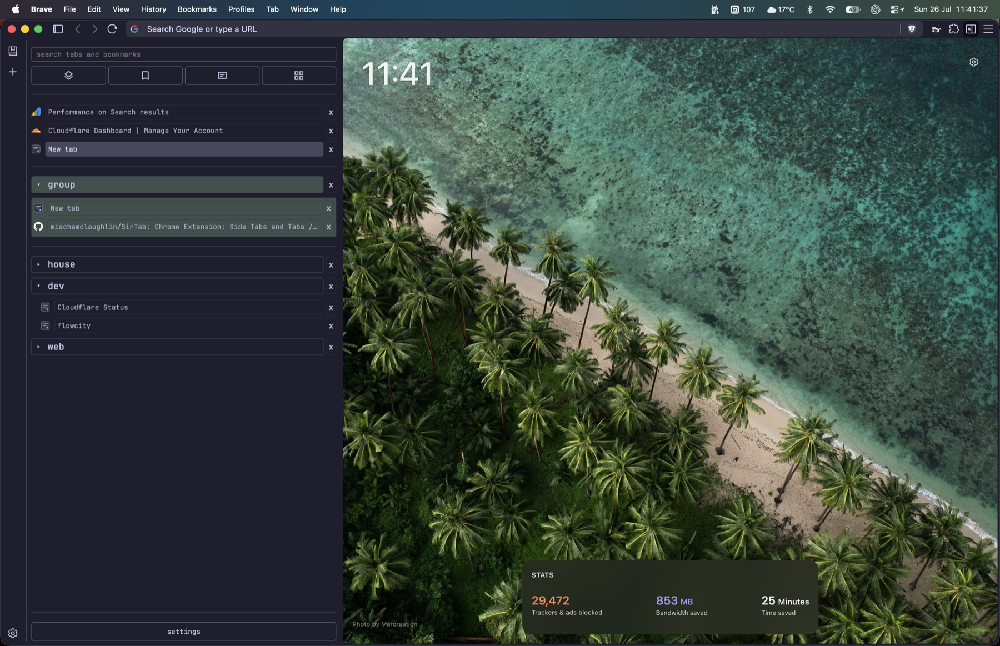
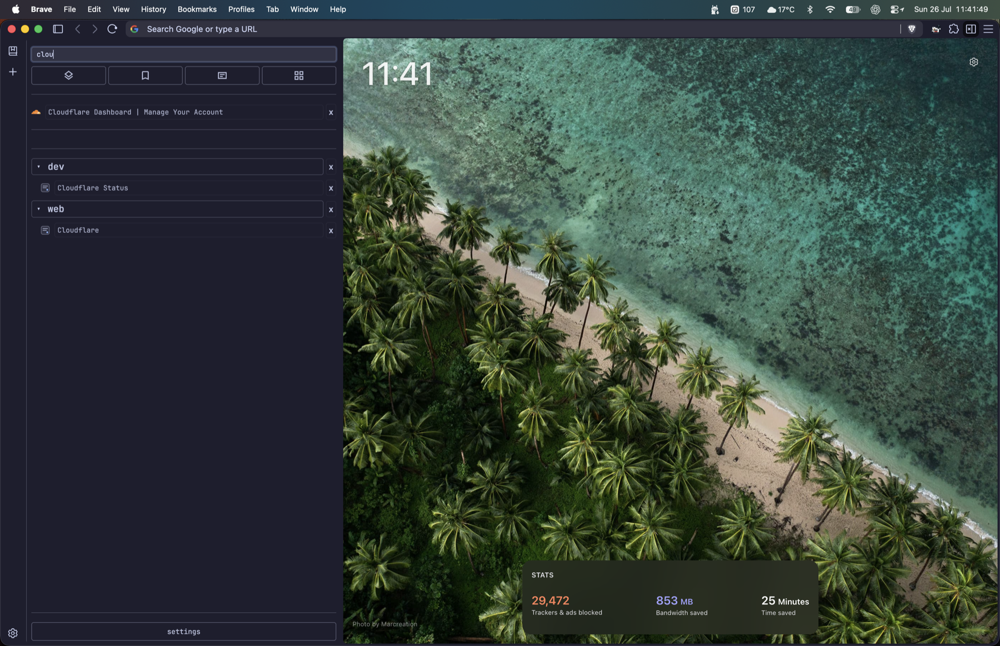
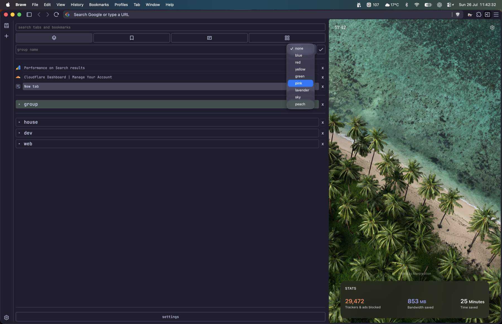
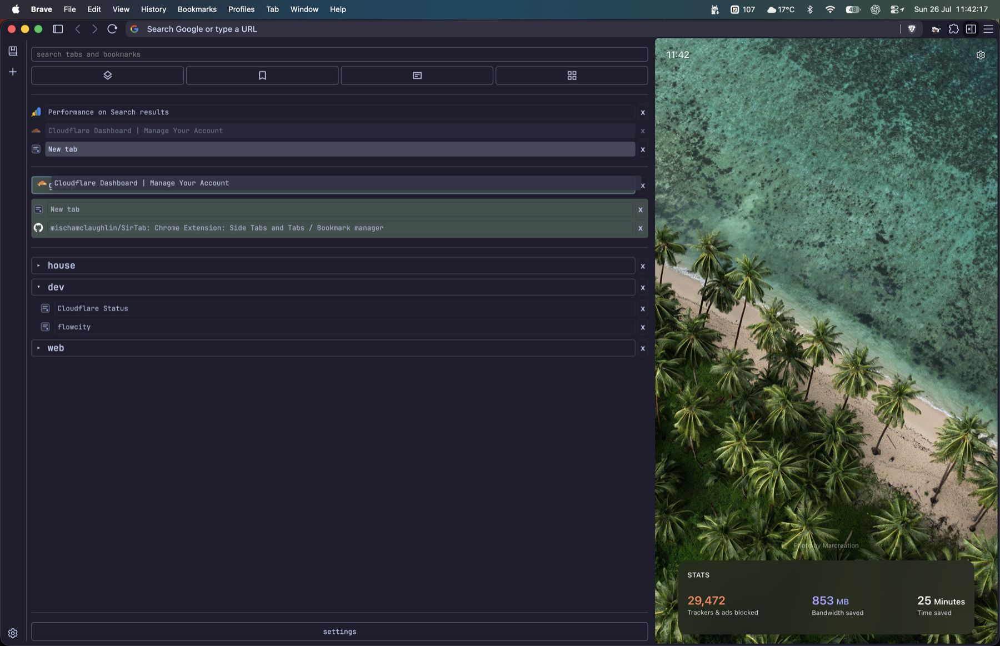
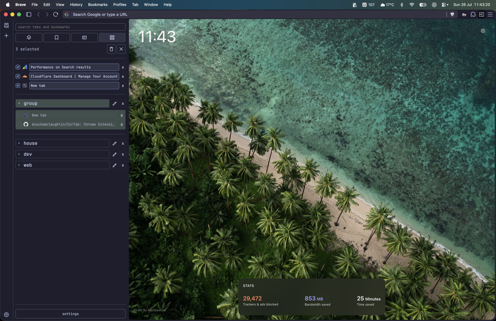
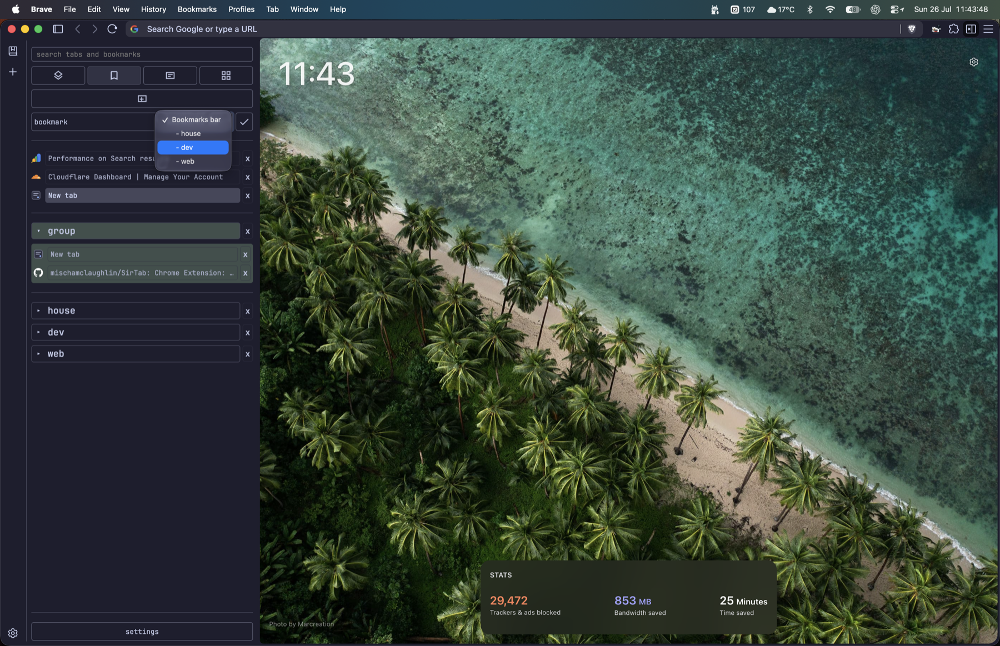
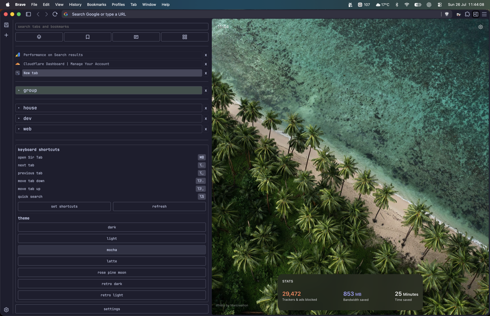

# Sir Tab

Sir Tab is a Chrome side-panel extension for managing tabs, tab groups, and
bookmarks from one place.



## Features

- View, switch, and organise open tabs from the side panel.
- Search across tabs and bookmarks.
- Create colour-coded tab groups and drag tabs between them.
- Create bookmarks inside existing folders.
- Select and close multiple tabs at once.
- Move between tabs and reorder them with keyboard shortcuts.
- Choose from seven built-in colour themes.

### Search tabs and bookmarks



### Create colour-coded groups



### Organise tabs with drag and drop



### Select and edit in batches



### Create bookmarks in folders



### Shortcuts and themes



## Development

Install dependencies and build the extension:

```bash
npm install
npm run build
```

Load the generated `dist/` directory as an unpacked extension in Chrome.

> Not submitted to the Webstore yet, using and testing first.
>
> Works Best, with Brave using sidetabs and having them hidden.

## Support

- Repository: <https://github.com/mischamclaughlin/SirTab>
- Issues: <https://github.com/mischamclaughlin/SirTab/issues>
